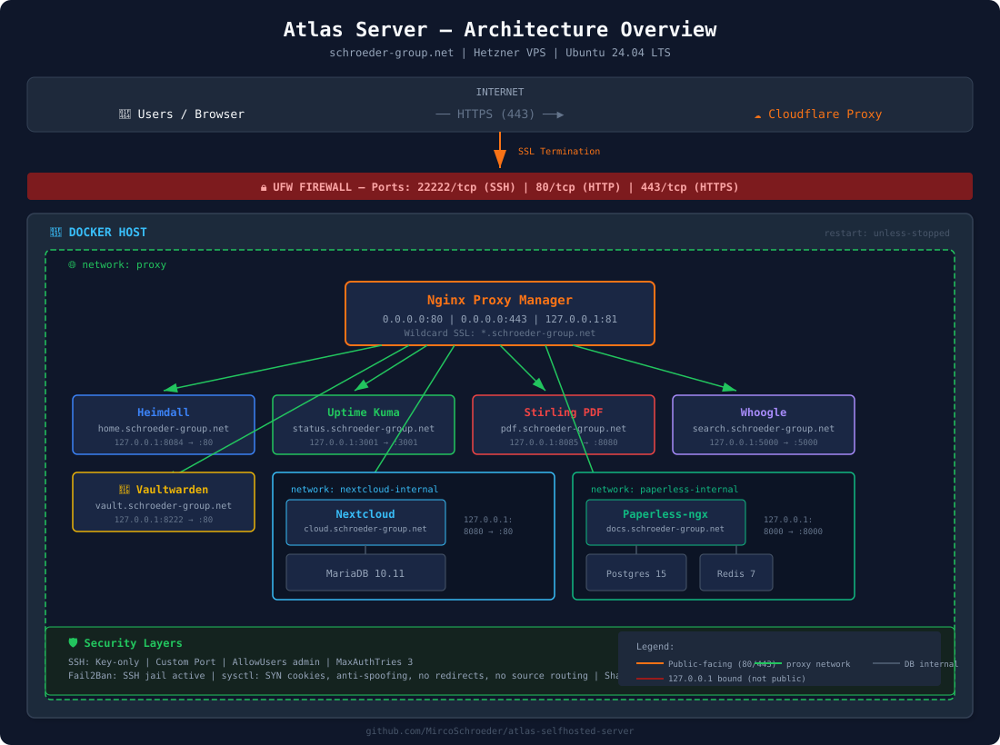

# Atlas — Self-Hosted Infrastructure Server

A production-grade, self-hosted server infrastructure running 8 containerized services behind a hardened reverse proxy. Built on a Hetzner VPS with Ubuntu 24.04 LTS, secured with layered defenses and accessible via custom domain with wildcard SSL.

**Domain:** `schroeder-group.net`  
**Hostname:** Atlas  
**OS:** Ubuntu 24.04.4 LTS  
**Provider:** Hetzner Cloud  

---

## Architecture

All services run as Docker containers behind Nginx Proxy Manager. Only three ports are exposed to the internet. Every service except NPM is bound to `127.0.0.1`, making it inaccessible from outside without the reverse proxy.



**Key design decisions:**

- **127.0.0.1 port binding** — No container (except NPM) is directly reachable from the internet. NPM is the single entry point on ports 80/443.
- **Database isolation** — Nextcloud's MariaDB and Paperless' PostgreSQL run in separate internal Docker networks (`nextcloud-internal`, `paperless-internal`), invisible to other containers.
- **Wildcard SSL** — A single Let's Encrypt wildcard certificate via Cloudflare DNS Challenge secures all subdomains.
- **Cloudflare Proxy** — The server's real IP is hidden behind Cloudflare's edge network.

---

## Security Measures

### SSH Hardening
- Key-based authentication only (password auth disabled)
- Custom SSH port (non-standard)
- `PermitRootLogin no`
- `AllowUsers` restricted to a single admin user
- `MaxAuthTries 3`, `LoginGraceTime 30`
- `X11Forwarding no`
- Idle timeout via `ClientAliveInterval` / `ClientAliveCountMax`

### Firewall (UFW)
Only three ports open:
| Port | Protocol | Purpose |
|------|----------|---------|
| Custom | TCP | SSH |
| 80 | TCP | HTTP (redirect to HTTPS) |
| 443 | TCP | HTTPS (NPM) |

All other incoming traffic is denied by default.

### Brute-Force Protection (Fail2Ban)
- SSH jail active with UFW backend
- 3 max retries within 1-hour window
- 30-day ban on violation

### Kernel Hardening (sysctl)
- SYN flood protection (`tcp_syncookies`)
- IP spoofing prevention (`rp_filter`)
- ICMP redirect rejection (MITM protection)
- Source routing disabled
- Martian packet logging enabled
- IPv6 disabled

### Additional Measures
- Shared memory secured with `noexec,nosuid`
- Automatic security updates via `unattended-upgrades`
- Unnecessary services disabled (`snapd`, `cups`)
- NPM Access Lists for sensitive admin panels

---

## Services

| Service | Subdomain | Purpose | Internal Port |
|---------|-----------|---------|---------------|
| **Nginx Proxy Manager** | `npm.*` | Reverse proxy, SSL termination | 127.0.0.1:81 |
| **Heimdall** | `home.*` | Application dashboard | 127.0.0.1:8084 |
| **Uptime Kuma** | `status.*` | Service monitoring | 127.0.0.1:3001 |
| **Nextcloud** + MariaDB | `cloud.*` | File storage & sync | 127.0.0.1:8080 |
| **Paperless-ngx** + PostgreSQL + Redis | `docs.*` | Document management | 127.0.0.1:8000 |
| **Stirling PDF** | `pdf.*` | PDF tools | 127.0.0.1:8085 |
| **Whoogle** | `search.*` | Privacy search engine | 127.0.0.1:5000 |
| **Vaultwarden** | `vault.*` | Password manager | 127.0.0.1:8222 |

All subdomains use `*.schroeder-group.net`.

---

## Docker Network Topology

```
┌─────────────────────────────────────────────┐
│  network: proxy                             │
│                                             │
│  NPM ←→ Heimdall                            │
│  NPM ←→ Uptime Kuma                         │
│  NPM ←→ Nextcloud ←→ [nextcloud-internal]   │
│  NPM ←→ Paperless ←→ [paperless-internal]   │
│  NPM ←→ Stirling PDF                        │
│  NPM ←→ Whoogle                             │
│  NPM ←→ Vaultwarden                         │
│                                             │
│  ┌──────────────────────┐                   │
│  │ nextcloud-internal   │                   │
│  │ Nextcloud ←→ MariaDB │                   │
│  └──────────────────────┘                   │
│                                             │
│  ┌───────────────────────────┐              │
│  │ paperless-internal        │              │
│  │ Paperless ←→ PostgreSQL   │              │
│  │ Paperless ←→ Redis        │              │
│  └───────────────────────────┘              │
└─────────────────────────────────────────────┘
```

---

## Repository Structure

```
atlas-server/
├── README.md
├── docs/
│   └── architecture.svg
├── screenshots/
│   ├── docker-ps.png
│   ├── ufw-status.png
│   ├── npm-dashboard.png
│   ├── npm-ssl-certificate.png
│   ├── uptime-kuma.png
│   ├── nextcloud.png
│   ├── paperless.png
│   ├── vaultwarden.png
│   ├── stirling-pdf.png
│   ├── whoogle.png
│   ├── heimdall.png
│   └── fail2ban-status.png
├── compose/
│   ├── npm/docker-compose.yml
│   ├── nextcloud/docker-compose.yml
│   ├── paperless/docker-compose.yml
│   ├── vaultwarden/docker-compose.yml
│   ├── uptimekuma/docker-compose.yml
│   ├── heimdall/docker-compose.yml
│   ├── stirlingpdf/docker-compose.yml
│   └── whoogle/docker-compose.yml
├── hardening/
│   ├── sshd_config.example
│   ├── 99-hardening.conf
│   └── ufw-rules.md
└── scripts/
    └── setup.sh
```

---

## Setup Script

An automated setup script (`scripts/setup.sh`) is included that handles:
1. Admin user creation with sudo privileges
2. SSH hardening (config deployment)
3. UFW firewall configuration
4. Fail2Ban installation and configuration
5. Kernel hardening via sysctl
6. Shared memory protection
7. Automatic security updates
8. Docker and Docker Compose installation
9. Docker network creation
10. Directory structure setup

> **Note:** The script is designed for Ubuntu 24.04 LTS on a fresh server. Review and adjust variables before running.

---

## Screenshots

See the [screenshots/](screenshots/) directory for visual documentation of the running infrastructure.

---

## Lessons Learned

- **Docker bypasses UFW by default** — Containers that publish ports write their own iptables rules, ignoring UFW entirely. Binding to `127.0.0.1` and routing through a reverse proxy solves this cleanly.
- **Pi-hole on a public VPS is risky** — An open port 53 turns the server into a public DNS resolver, which gets abused for amplification attacks within hours. Pi-hole belongs on a local network device or behind a VPN tunnel.
- **Database containers don't need proxy access** — Isolating databases in their own Docker networks reduces the attack surface. A compromised container in the proxy network cannot reach another service's database.
- **Cloudflare Proxy hides the real IP** — But only if the server never had DNS records pointing to it without the proxy enabled. Setting this up from day one is important.
- **SSH keys must have exact permissions** — `700` for `.ssh/`, `600` for `authorized_keys`, correct ownership. SSH silently rejects keys if permissions are wrong.

---

## Tools & Technologies

`Ubuntu 24.04` · `Docker` · `Docker Compose` · `Nginx Proxy Manager` · `UFW` · `Fail2Ban` · `sysctl` · `Let's Encrypt` · `Cloudflare` · `Nextcloud` · `Paperless-ngx` · `MariaDB` · `PostgreSQL` · `Redis` · `Vaultwarden` · `Uptime Kuma` · `Heimdall` · `Stirling PDF` · `Whoogle`

---

## Author

**Mirco Schroeder**  
GitHub: [github.com/MircoSchroeder](https://github.com/MircoSchroeder)
